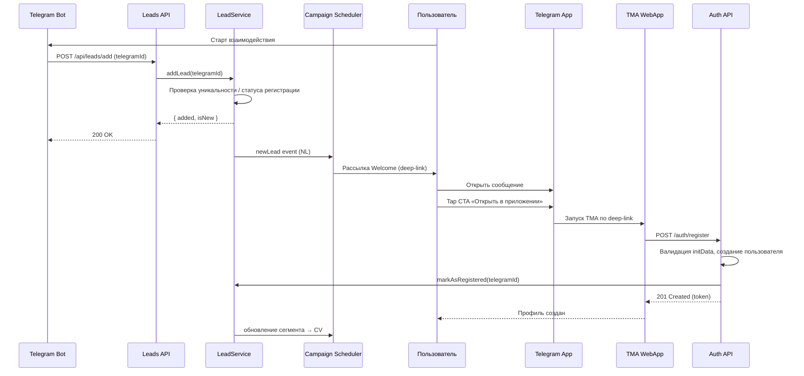

# Lead Campaigns Playbook

## 1. Текущие потоки лидов и регистрации

### 1.1. Приём и ведение лидов
- **Источник:** Telegram-бот вызывает `POST /api/leads/add` c заголовком `X-Bot-Secret` и `telegramId` во входном JSON. Без валидного `telegramId` возвращается `400`, без секрета — `401`. 【F:LEADS_API.md†L4-L33】
- **Уникальность:** перед созданием лида выполняется поиск `Lead.findOne({ telegramId })`. Повторный запрос возвращает `added: false, isNew: false` без модификаций. 【F:src/services/LeadService.ts†L7-L23】
- **Привязка к регистрации:** перед созданием лида проверяется наличие пользователя в коллекции `User`; признак `isRegistered` ставится на момент создания, если пользователь уже существовал. 【F:src/services/LeadService.ts†L15-L22】
- **Метаданные:** при создании сохраняются `createdAt` и, при отдельном сценарии `markViewedPrelaunchStats`, флаги `viewedPrelaunchStats`/`viewedPrelaunchStatsAt`. 【F:src/services/LeadService.ts†L18-L65】
- **Уведомления:** после успешного создания отправляется оповещение через `TelegramNotificationService`. Ошибки логируются, но не прерывают создание. 【F:src/services/LeadService.ts†L24-L33】

### 1.2. Обновление статусов и статистика
- **Статистика:** сервис предоставляет суммарные метрики (`total`, `registered`, `unregistered`) через `LeadService.getStats()` и публичный эндпоинт `GET /api/leads/stats`. 【F:LEADS_API.md†L35-L52】【F:src/services/LeadService.ts†L35-L52】
- **Маркировка регистрации:** при регистрации пользователя вызывается `LeadService.markAsRegistered`, который обновляет `isRegistered` по `telegramId`. При ошибке возвращается `false`, но процесс регистрации продолжается. 【F:src/services/LeadService.ts†L54-L65】【F:src/controllers/authController.ts†L200-L233】
- **Админ-доступ:** доступны защищённые админ-эндпоинты для просмотра и экспорта лидов. 【F:LEADS_API.md†L54-L63】

### 1.3. Регистрация пользователя
- **Валидация Telegram initData:** при включённом требовании initData проходит проверку подписи, свежести и соответствия `telegramId`; нарушения завершаются `401`. 【F:src/controllers/authController.ts†L43-L118】
- **Атрибуция кампаний и рефералов:** кампания может прийти из тела запроса, реферального кода (`CODE__CAMPAIGN`) или аналитики `bot_start_shown`. 【F:src/controllers/authController.ts†L24-L118】
- **Создание пользователя:** сохраняются профильные данные, сегмент `cohort`, кампания, роль. 【F:src/controllers/authController.ts†L120-L173】
- **Аналитика и уведомления:** при успешной регистрации пишется событие `register` в `AnalyticsEvent` и отправляется уведомление в Telegram-канал. 【F:src/controllers/authController.ts†L175-L220】
- **Сервисные действия после регистрации:** пользователь помещается в предстартовую очередь (`PrelaunchService.join`), лид помечается зарегистрированным. 【F:src/controllers/authController.ts†L221-L233】

## 2. Бизнес-правила рассылок (согласовано с продуктом)

### 2.1. Сегментация лидов
1. **New Lead (NL):** `isRegistered = false`, не получал ни одной кампании.
2. **Nurturing Lead (NR):** `isRegistered = false`, получил ≥1 кампанию, но не открыл TMA.
3. **Reactivated Lead (RL):** ранее открыл TMA, но не завершил регистрацию за 72 часа.
4. **Converted (CV):** `isRegistered = true` — исключаются из дальнейших лидовых кампаний. Сегмент `all_leads` теперь включает только незарегистрированных пользователей; для коммуникаций с зарегистрированными требуется отдельный флаг/сегмент.

### 2.2. Частоты и триггеры
- **NL Welcome серия:**
  - `T0`: мгновенно после создания лида — приветственное сообщение с оффером.
  - `T0 + 24h`: напоминание с социальным доказательством, если нет события открытия TMA.
- **NR Nurture цикл:** повторяющиеся сообщения раз в 72 часа (макс. 4 касания) с чередованием ценностных блоков. Снимается при открытии TMA или регистрации.
- **RL Reactivation:** одно сообщение через 72 часа после первого открытия TMA без регистрации. Повтор через 7 дней (последнее касание), если пользователь не активировался.
- **Антиспам:** общее ограничение — не более одного сообщения в 24 часа на пользователя и 6 сообщений в месяц. Инструмент кампаний обязан проверять лимит перед отправкой.

### 2.3. Контент и формат TMA deep-link
- **Deep-link формат:** `https://t.me/<bot_username>?startapp=lead_<campaignCode>_<telegramId>`.
  - `campaignCode` — латиница/цифры, длина до 20 символов, совпадает с идентификатором кампании.
  - `telegramId` — числовой идентификатор без хеширования (для персонализации).
  - Пример: `https://t.me/product_bot?startapp=lead_REACT72_123456789`.
- **UTM-теги:** в параллель отправляется `AnalyticsEvent` с `name: 'lead_campaign_sent'` и полями `segment`, `campaignCode`, `telegramId`, `messageId`.
- **Тональность:** каждое сообщение включает CTA «Открыть в приложении», краткое напоминание ценности и один социальный proof.

### 2.4. Управление статусами
- После отправки кампании в сегментах NL/NR сохраняем отметку `lastCampaignAt` и `campaignsSent` в сущности лида.
- При открытии deep-link фиксируем событие `lead_tma_opened`; сегмент NL→NR или RL, в зависимости от истории.
- При регистрации — сегмент CV, дальнейшие лидовые кампании запрещены, но можно добавлять в продуктовые рассылки.

### 2.5. Коммуникация с маркетингом по зарегистрированным пользователям
- **Когда запрашивать кампанию:** если требуется коммуникация для зарегистрированных пользователей (например, ретеншн-акция, запуск новой функции, повторное вовлечение), маркетинг подаёт запрос в продуктовую команду — такие кампании не попадают в `all_leads` и требуют отдельного сегмента/флага в кампаниях.
- **Что подготовить:**
  - целевую аудиторию (критерии отбора зарегистрированных пользователей);
  - цель/ожидаемый результат кампании;
  - черновик сообщения и метрики успеха.
- **Дальнейшие шаги:**
  1. Маркетинг создаёт тикет в бэклоге продуктовой команды с пометкой `registered_campaign` и прикладывает материалы выше.
  2. Продукт уточняет ограничения по частотам/сегментам и подтверждает техническую реализацию (создание флага, настройка фильтра).
  3. После согласования Product Ops координирует запуск (настройка рассылки, QA, календарь коммуникаций) и сообщает маркетингу дату запуска.

## 3. Диаграмма последовательностей

